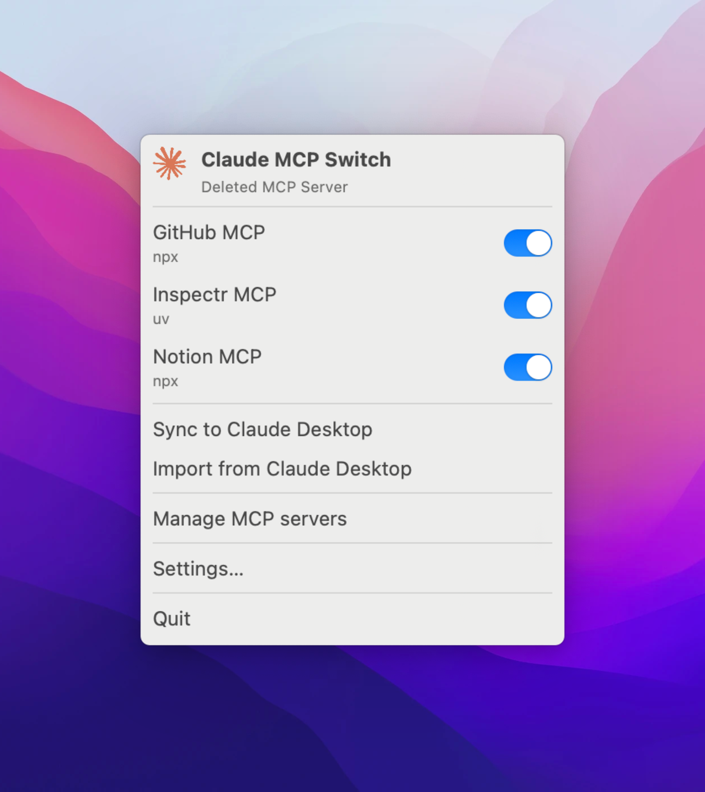
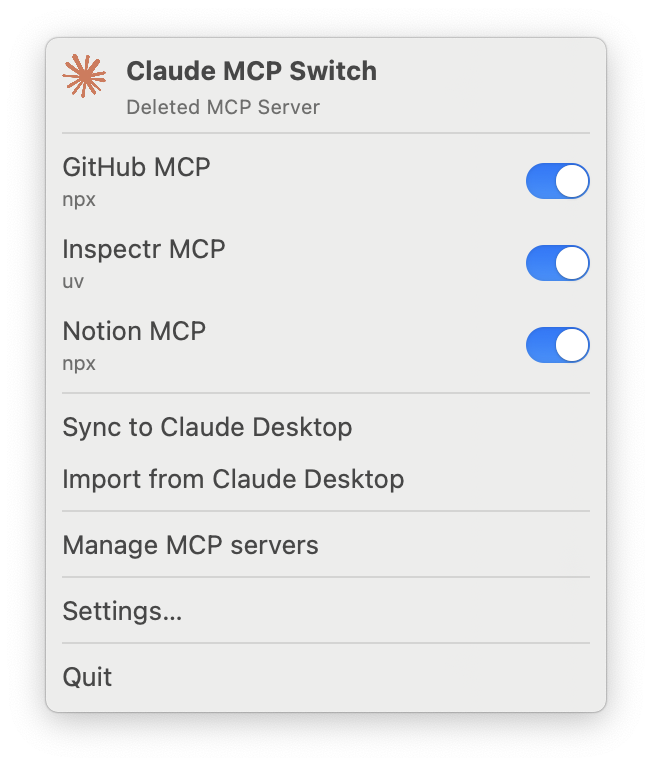
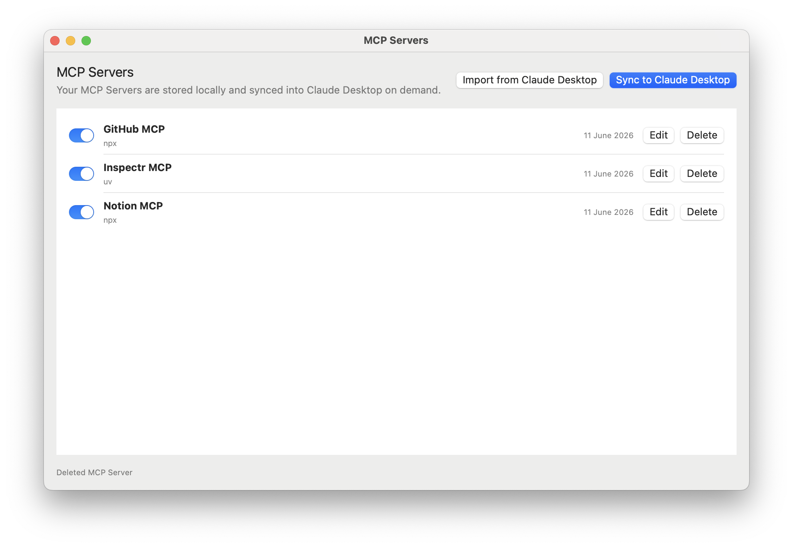
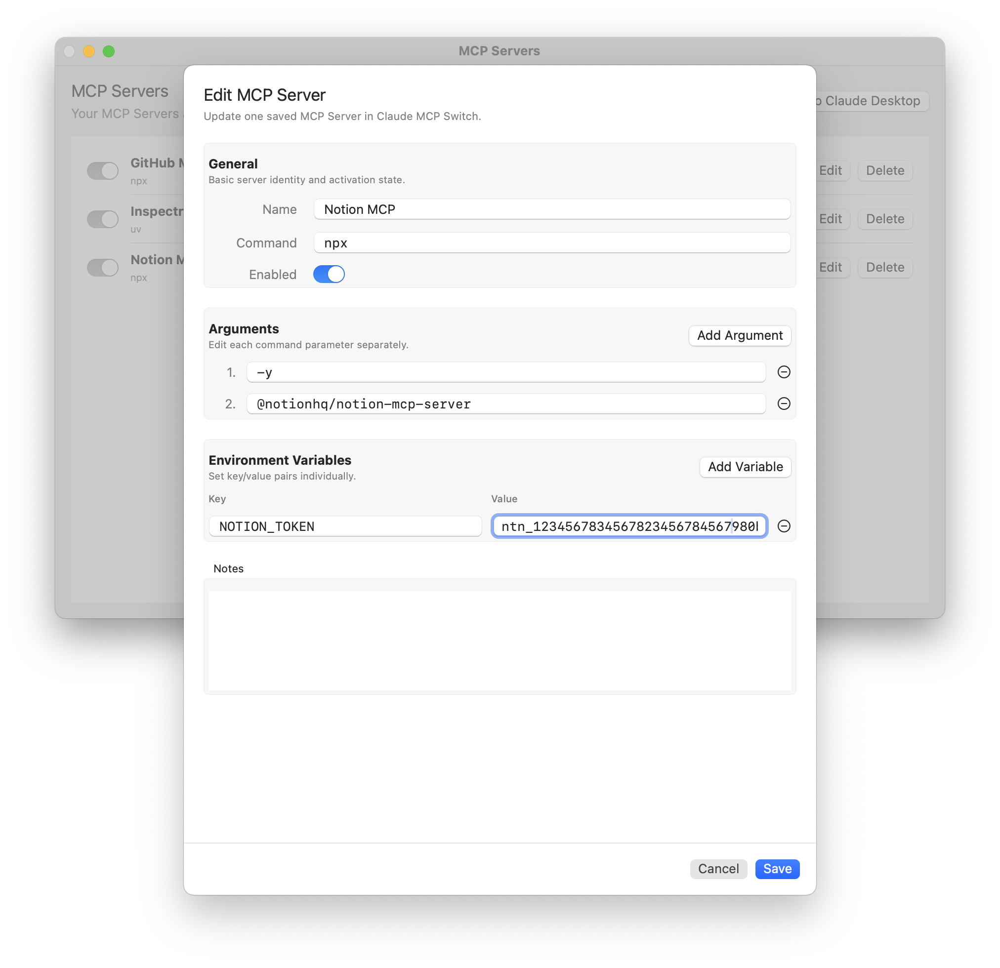

# Claude MCP Switch


Claude MCP Switch is a native macOS menu bar app for managing Claude Desktop configured MCP Servers.



It gives you a fast desktop UI for quickly enabling or disabling the MCP server from Claude Desktop App, instead of having to edit the JSON config file. 


## Features

- Native macOS menu bar app built with SwiftUI
- Import `mcpServers` from Claude Desktop config
- Local file-backed storage for saved MCP Servers
- Enable or disable servers from the menu bar or manager window
- Edit server name, command, arguments, environment variables, and notes
- Sync enabled servers back into Claude Desktop
- Sync review flow with diff preview for additions and updates
- Separate removal warning when sync would only remove Claude Desktop entries
- Atomic writes with backups for both local storage and Claude Desktop config updates

## Screenshots

| Menu Bar | MCP Servers | Edit Server | 
| -------- | ----------- | ----------- | 
|  |  |  | 

## Get Started

### 1. Install Claude MCP Switch

Choose one of these installation paths:

#### Option A: Homebrew

When release distribution is active, install with:

```bash
brew tap inspectr-hq/homebrew-inspectr
brew install --cask claude-mcp-switch
```

#### Option B: DMG

1. Open the GitHub Releases page for Claude MCP Switch.
2. Download the latest `ClaudeMcpSwitch-<version>.dmg`.
3. Open the DMG and drag `Claude MCP Switch.app` into your `Applications` folder.

#### Option C: ZIP

1. Open the GitHub Releases page for Claude MCP Switch.
2. Download the latest `ClaudeMcpSwitch-<version>.zip`.
3. Extract it and move `ClaudeMcpSwitch.app` to your `Applications` folder.

#### Option D: Build from Source

Open in Xcode:

```bash
open app/ClaudeMcpSwitch.xcodeproj
```

Or use SwiftPM:

```bash
cd app
swift build
swift run ClaudeMcpSwitch
```

### 2. First Launch on macOS

If you run a local debug build from Xcode, macOS should usually launch it normally.

If you open an unsigned or ad hoc distributed build, macOS may warn because the app is not yet packaged through a signed and notarized release flow.

If macOS blocks launch:

1. Move the app into `Applications` if needed.
2. Right-click the app and choose `Open`.
3. Click `Open` again in the macOS warning dialog.

If Finder still blocks the app, use:

- `System Settings -> Privacy & Security` and click `Open Anyway`.

### 3. Import Your MCP Servers

1. Launch Claude MCP Switch.
2. Open the menu bar dropdown.
3. Choose `Import from Claude Desktop`.
4. Review and enable the MCP Servers you want to manage.
5. Use `Sync to Claude Desktop` when you want Claude Desktop `mcpServers` to match the enabled set.

## Sync Behavior

When you sync to Claude Desktop:

- only the `mcpServers` section is rewritten
- unrelated Claude Desktop config keys are preserved
- enabled MCP Servers in Claude MCP Switch are treated as the source of truth
- additions and updates show a compare-style review sheet
- pure removals show a simpler warning dialog

Approving sync replaces Claude Desktop `mcpServers` with the enabled set from Claude MCP Switch.

## Development

### Requirements

- macOS
- Xcode 16 or newer
- Swift 5.10+ toolchain

### Run Tests

From the repository root:

```bash
cd app
swift test
```

Or:

```bash
swift test --package-path app
```

### Open in Xcode

```bash
open app/ClaudeMcpSwitch.xcodeproj
```
